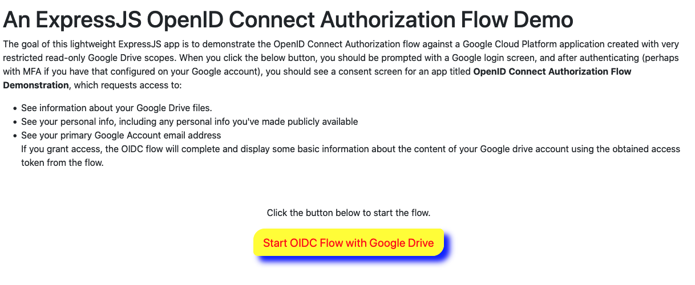
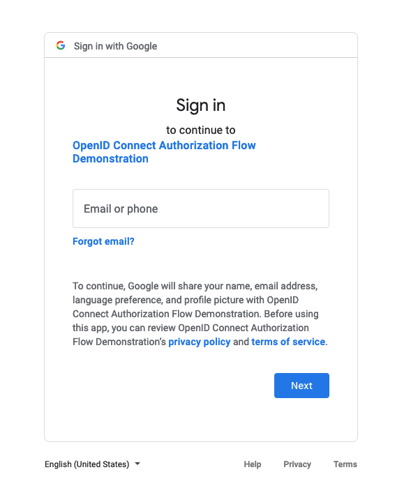
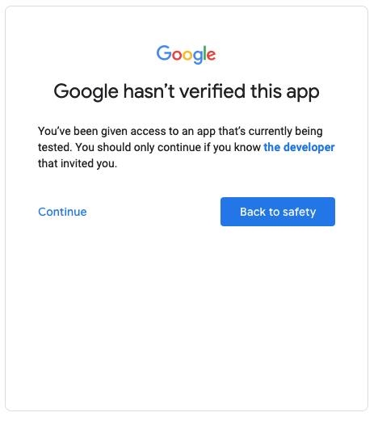
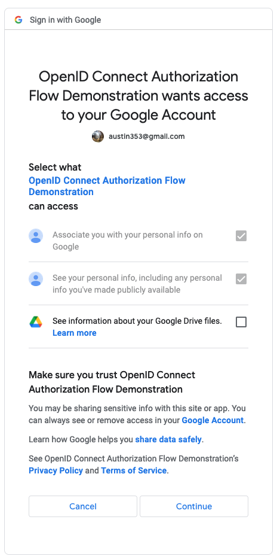
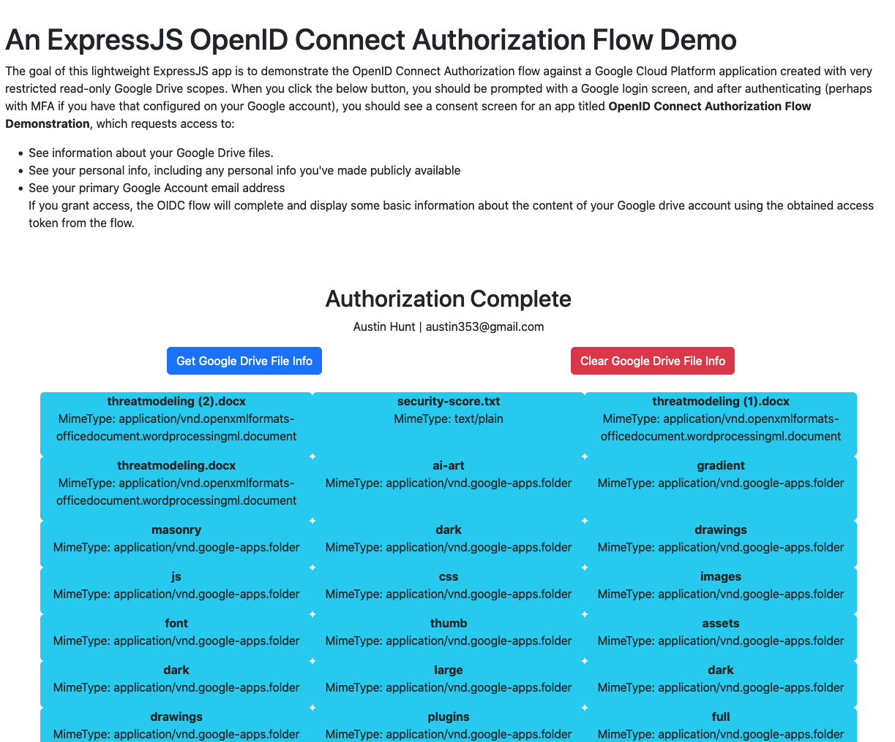
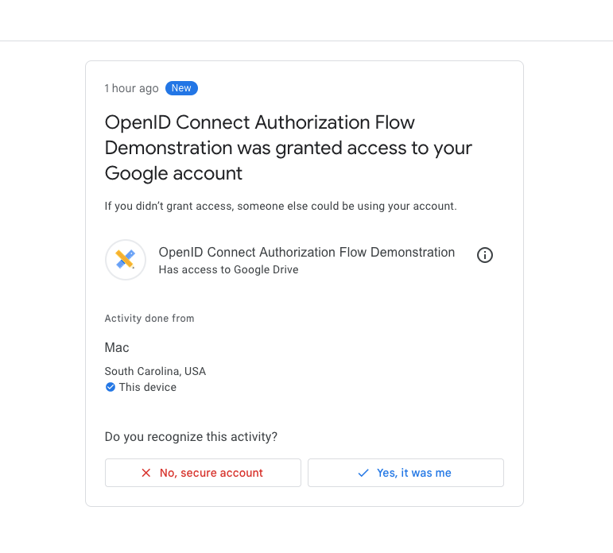
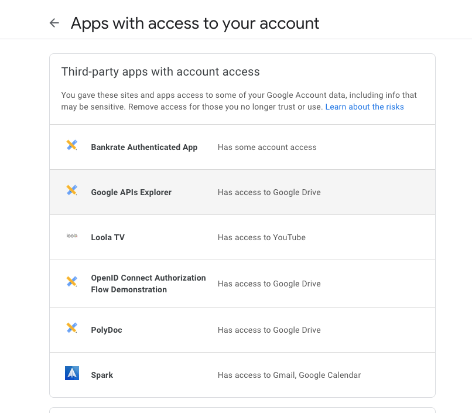
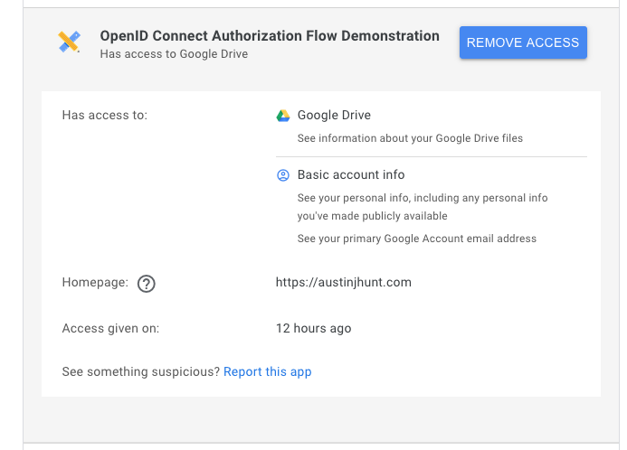

# Demonstration of OAuth 2.0 Flow with Express and Google Drive

This is a simple lightweight app for demonstrating use of Google's OAuth 2.0 APIs (which conform to the OIDC specification) for authN and authZ with Express and Google Drive.

## Overview

The goal of this lightweight ExpressJS app is to demonstrate the OpenID Connect Authorization flow against a Google Cloud Platform application created with very restricted read-only Google Drive scopes. More specifically, it follows the official [Google OAuth 2.0 implementation for authentication](https://developers.google.com/identity/protocols/oauth2/openid-connect) which happens to conform to the [OpenID Connect specification](https://openid.net/connect/), and is [OpenID Certified](https://openid.net/certification/). In short, Google's OAuth 2.0 APIs can be used for both authentication (OIDC) and authorization (OAuth).

### Implementation

#### GCP

First things first, I created a new project in Google called **Simple OAuth Demo**, configured a consent screen for it when authorized JS origin `http://localhost:8080` and redirect URL `http://localhost:8080/redirect_uri` (which is the Express route that handles the redirect back from the consent screen). I then created an OAuth client ID in the credentials screen within the project, and downloaded the credentials JSON file (stored as a gitignored config.js in the repo).

From here, I moved to the Express development.

#### Express App

The app was implemented with the simple [Express](https://expressjs.com/) web framework for [Node.js](https://nodejs.org/en/).

When run, you're first presented with a [basic home page](views/index.ejs) with a button that when clicked will trigger the [OIDC-conforming OAuth 2.0 authorization flow documented by Google](https://developers.google.com/identity/protocols/oauth2/openid-connect).



When you click the button (which is really a link to the `/start-flow` GET route), behind the scenes, the first thing that is happening is the generation of a random anti-forgery `state` token such that this value can be compared with the `state` value returned after Google redirects the user back to the app.

Then, the user gets redirected to the authentication endpoint on Google with a series of query parameters as defined below, coming from the (gitignored) config file pulled from GCP when creating the OAuth client.
I made sure to include access_type: offline in this particular request to allow for the use of a refresh token without involving the user when the access token expires.

```
app.get("/start-flow", (req, res) => {
  let state = getRandomValue(24);
  req.session.state = state;
  let full_auth_url =
    `${config.auth_uri}?` +
    serialize({
      response_type: "code", // should always be code for basic auth code flow
      client_id: config.client_id,
      access_type: "offline", // allow refresh token
      scope: scopes.join(" "),
      redirect_uri: config.redirect_uris[0],
      state: req.session.state,
      nonce: getRandomValue(24), // random value for replay protection
    });
  res.redirect(full_auth_url);
});
```

When redirected, the user gets prompted first with a login screen if not already logged into Google (the identity provider).



After logging in (ideally with MFA configured on the Google Account), the user then gets a warning about the client being unverified by Google which is definitely true since this is very much a small-scale test application.


If the user clicks `Continue`, they then get prompted with the OAuth Consent Screen configured during the GCP setup. This page outlines every permission (scope) being requested by the client, and allows the user to check the specific permissions they want to grant to the client.



After the consent screen, Google then redirects the user back to the configured `redirect_uri` for the client which in the case of this app is the `/redirect_uri` route handled by the following code in [index.js](index.js). When redirected to `/redirect_uri` by Google, two important query parameters are included: `state` and `code`. The first thing that happens here is the verification of the state token by comparing it against the state token which was previously generated when starting the flow. If the token matches, we take the `code` query parameter (which is a one-time authorization code) and exchange it with Google's token endpoint for an access token and an ID token. We also update the user's session to indicate the authorization. Moreover, we use the newly obtained access token to hit the (About API endpoint](https://developers.google.com/drive/api/v3/reference/about) to pull some basic Google Account information about the user (namely first name and email address).

```

app.get("/redirect_uri", (req, res) => {
  // redirect URI configured on GCP to which
  // auth endpoint response is sent after user consents
  // verify that state in query param matches session state generated before
  // sending user to auth endpoint
  if (req.query.state === req.session.state) {
    console.log("state matches");
    req.session.authorized = true;
    exchangeAuthCodeForAccessToken(req, res).then(() => {
      fetch("https://www.googleapis.com/drive/v3/about?fields=user", {
        method: "GET",
        headers: {
          Authorization: `Bearer ${req.session.access_token}`,
          Accept: "application/json",
        },
      })
        .then((response) => response.json())
        .then((data) => {
          if (data.user) {
            console.log(data.user.emailAddress);
            req.session.user = data.user;
            req.session.emailAddress = data.user.emailAddress;
            req.session.photoLink = data.user.photoLink;
            req.session.displayName = data.user.displayName;
          }
        })
        .then(() => {
          res.render("index", {
            authorized: req.session.authorized,
            emailAddress: req.session.emailAddress,
            photoLink: req.session.photoLink,
            displayName: req.session.displayName,
          });
        });
    });
  } else {
    console.log(`Returned state  does not match session state `);
    res.redirect("/start-flow");
  }
});
```

With that information pulled from Google via the API, EJS is then used to embed that information into the front end view. EJS is also used to conditionally show a button for pulling Google Drive File Information for users who are authorized (by embedding the boolean `authorized` session variable into the EJS view). If the user is authorized, they see the button (really a link to the `/get-files` route) to pull the basic metadata about their Google Drive Files.
![]

When clicked, the `/get-files` route handler on the server side executes and pulls a files list from the [Google Drive v3 API](https://developers.google.com/drive/api/v3/reference) using the access token stored in the session. For each of the returned files, the JavaScript on the client site appends a basic container element with the file's name and mimetype displayed.


At this point, the user has consented to the app reading information from the user's Google account. The user can confirm this by looking at a number of screens on their Google Account:

##### Activity on Google Account



##### Third party apps with access



The user can optionally revoke that access as shown below:


# Running the App

1. Clone the repository and navigate into it via CLI.
2. Run the following commands:

```
npm i
node index.js
```
